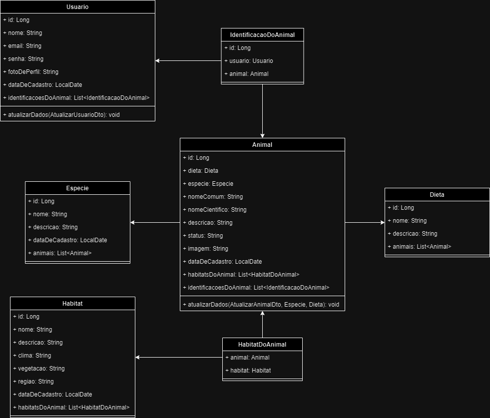

# API OceanDex

## Rodando a aplicação

Para rodar a aplicação, siga estes passos:

1. Abra a pasta chamada "oceandex" em uma IDE, de preferência o IntelliJ.
2. Execute o arquivo "OceandexApplication".
3. Aguarde a inicialização da aplicação.
4. Após a inicialização, você estará pronto para realizar as requisições.

OBS: Nas pasta de "documentos" há a documentação do projeto e uma carga de dados para a realização de testes.

## Diagrama de Classes das Entidades

## Vídeo Apresentação

...

## Endpoints

- Usuário

| Método        | URL             |
| ------------- | --------------- |
| POST          | /usuarios       |
| GET           | /usuarios       |
| GET           | /usuarios/{id}  |
| PUT           | /usuarios/{id}  |
| DELETE        | /usuarios/{id}  |
| GET           | /usuarios/email |
| GET           | /usuarios/identificacoes  |
| POST          | /usuarios/login |

- Animal

| Método        | URL            |
| ------------- | -------------- |
| POST          | /animais       |
| GET           | /animais       |
| GET           | /animais/{id}  |
| PUT           | /animais/{id}  |
| DELETE        | /animais/{id}  |
| GET           | /animais/especie/nome |
| GET           | /animais/dieta/nome  |
| GET           | /animais/habitat/nome  |
